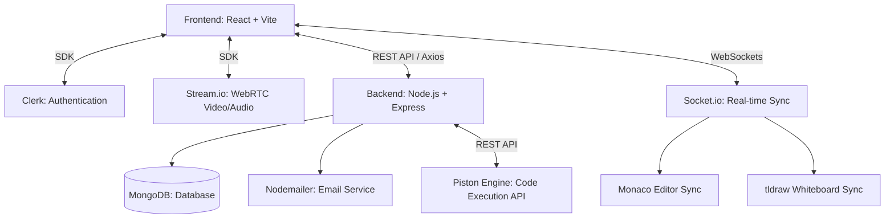

<h1 align="center">✨ InterviewVerse ✨</h1>

<p align="center">
  <strong>The modern, full-stack platform to conduct technical interviews with live video, collaborative code editing, and integrated AI tools.</strong>
</p>

---

## 📖 Overview

**InterviewVerse** is a comprehensive, production-ready technical interview platform designed to streamline the remote hiring process. It empowers engineering teams to conduct flawless remote interviews by combining ultra-low-latency HD video calls, a real-time collaborative code editor (powered by Monaco), and a shared infinite whiteboard. 

With built-in secure code execution supporting multiple languages, instant candidate feedback emails, and comprehensive interviewer dashboards, InterviewVerse provides an all-in-one ecosystem for evaluating engineering talent.

---

## 📸 Screenshots

*(Add your screenshots to a `screenshots` folder and update the links below)*

### Landing Page


### Interview Dashboard & Code Editor


---

## 🏗️ System Architecture

The application follows a modern decoupled architecture, leveraging WebSockets for real-time collaboration and external APIs for heavy lifting (video processing, code execution).



---

## 🚀 Tech Stack

### Frontend
- **Framework:** React 18 (bootstrapped with Vite)
- **Styling:** Tailwind CSS + DaisyUI
- **State Management:** Zustand
- **Code Editor:** `@monaco-editor/react` (VSCode engine)
- **Whiteboard:** `tldraw` (Collaborative infinite canvas)
- **Video & Audio:** `@stream-io/video-react-sdk`
- **Authentication:** `@clerk/clerk-react`
- **Routing:** React Router v6
- **Animations:** Framer Motion
- **Icons:** Lucide React

### Backend
- **Runtime:** Node.js
- **Framework:** Express.js
- **Database:** MongoDB (with Mongoose ORM)
- **Real-time Engine:** Socket.io
- **Code Execution:** Piston API Integration
- **Email Service:** Nodemailer (with custom HTML templates)
- **CORS & Security:** Helmet, Express CORS

---

## ⚙️ Local Development Setup

Follow these steps to run the project locally on your machine.

### 1. Clone the repository
```bash
git clone https://github.com/yourusername/interview-verse.git
cd interview-verse
```

### 2. Backend Setup
Navigate to the backend directory, install dependencies, and configure environment variables.

```bash
cd backend
npm install
```

Create a `.env` file in the `backend` directory:
```env
PORT=3000
NODE_ENV=development

# MongoDB Connection
MONGODB_URI=your_mongodb_connection_string

# Authentication (Clerk Backend)
CLERK_PUBLISHABLE_KEY=your_clerk_publishable_key
CLERK_SECRET_KEY=your_clerk_secret_key

# Video API (Stream.io)
STREAM_API_KEY=your_stream_api_key
STREAM_API_SECRET=your_stream_api_secret

# Email Configuration (Nodemailer)
EMAIL_USER=your_email@gmail.com
EMAIL_PASS=your_app_password

# Client URL for CORS
CLIENT_URL=http://localhost:5173
```

Start the backend development server:
```bash
npm run dev
```

### 3. Frontend Setup
Open a new terminal, navigate to the frontend directory, install dependencies, and configure environment variables.

```bash
cd frontend
npm install
```

Create a `.env` file in the `frontend` directory:
```env
# API URL
VITE_API_URL=http://localhost:3000/api

# Authentication (Clerk)
VITE_CLERK_PUBLISHABLE_KEY=your_clerk_publishable_key

# Video API (Stream.io)
VITE_STREAM_API_KEY=your_stream_api_key
```

Start the frontend development server:
```bash
npm run dev
```

### 4. Open the Application
Navigate to `http://localhost:5173` in your browser.

---

## ✨ Core Features
1. **Live Code Editor:** Real-time synchronized Monaco editor with syntax highlighting for multiple languages.
2. **Secure Code Execution:** Run candidate code safely using the isolated Piston execution engine.
3. **HD Video Conferencing:** Seamless WebRTC-powered video and audio calls using Stream.io.
4. **Collaborative Whiteboard:** Draw architecture diagrams and logic flows together using tldraw.
5. **Interview Scheduling & Emails:** Schedule sessions from the dashboard and automatically dispatch beautifully designed HTML email invitations using Nodemailer.
6. **Authentication:** Secure sign-up/sign-in flows via Clerk.
7. **Premium UI/UX:** Glassmorphism design system, dark mode native, and micro-animations with Framer Motion.

---

<p align="center">
  Built with ❤️ for engineers.
</p>
